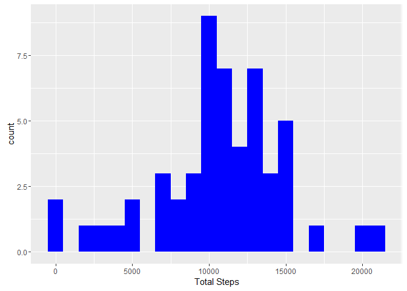
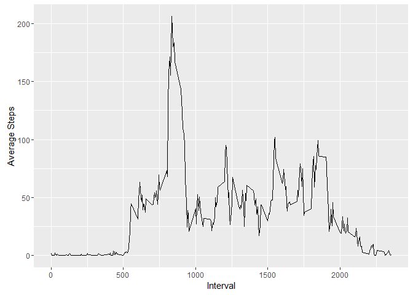
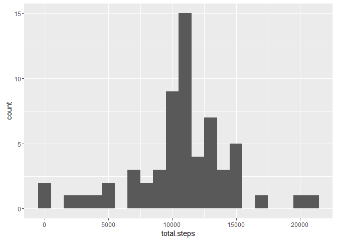
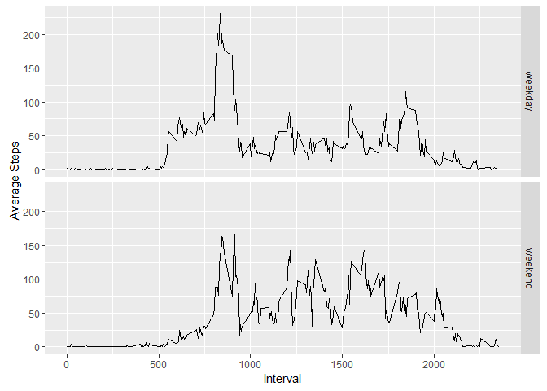

# Reproducible Research: Peer Assessment 1


```r
library(lubridate)
library(dplyr)
library(ggplot2)
library(tidyr)
library(xtable)


setwd("C:\\Users\\ditop\\mygit\\RepData_PeerAssessment1")
unzip(zipfile="activity.zip")
```

## Loading and preprocessing the data

Use read.csv() function to read "activity.csv", convert date string to date objects with lubridate package.


```r
rawdata <- tbl_df( read.csv("activity.csv", stringsAsFactors = FALSE) )
dt <- rawdata %>% mutate(date = ymd(date))
```


## What is mean total number of steps taken per day?

Calculate total steps by day.


```r
steps.per.day <- dt %>%
                 filter(!is.na(steps)) %>%
                 group_by(date) %>%
                 summarise(total.steps = sum(steps))
```

Histogram of the total number of steps taken each day:

```r
ggplot (steps.per.day, aes(x=total.steps)) + 
  geom_histogram( binwidth = 1000, fill = "blue") +
  labs(x= "Total Steps")
```

<!-- -->


Mean and median number of steps taken each day:


```r
mean.org <- mean(steps.per.day$total.steps)
median.org <- median(steps.per.day$total.steps)
mmdata <-data.frame("Data" = "Omiting NAs", "Mean Total Steps" = mean.org, "Median Total Steps" = median.org, stringsAsFactors = FALSE)
```


```r
print(xtable(mmdata), comment = FALSE, type ="html", include.rownames=FALSE)
```

<table border=1>
<tr> <th> Data </th> <th> Mean.Total.Steps </th> <th> Median.Total.Steps </th>  </tr>
  <tr> <td> Omiting NAs </td> <td align="right"> 10766.19 </td> <td align="right"> 10765 </td> </tr>
   </table>

## What is the average daily activity pattern?


```r
average.interval <- dt %>%
                    filter(!is.na(steps)) %>%
                    group_by(interval) %>%
                    summarise(average.steps = mean(steps))


ggplot(average.interval, aes(x = interval, y = average.steps)) +
  geom_line() +
  labs(x="Interval", y="Average Steps")
```

<!-- -->

The 5-minute interval that, on average, contains the maximum number of steps(206.1698113):


```r
arrange(average.interval, desc(average.steps))[1,]$interval
```

```
## [1] 835
```

## Imputing missing values

```r
missing <- is.na(dt$steps)
# How many missing
table(missing)
```

```
## missing
## FALSE  TRUE 
## 15264  2304
```

```r
dt.replaceNA <-     dt %>%
                    group_by(interval)  %>%
                    mutate(steps= ifelse(is.na(steps), mean(steps, na.rm=TRUE), steps))

steps.per.day.wo.nas <- dt.replaceNA %>%
                        filter(!is.na(steps)) %>%
                        group_by(date) %>%
                        summarise(total.steps = sum(steps))


ggplot (steps.per.day.wo.nas, aes(x=total.steps)) + 
  geom_histogram( binwidth = 1000)
```

<!-- -->

```r
mean.wo.nas <- mean(steps.per.day.wo.nas$total.steps)
median.wo.nas <- median(steps.per.day.wo.nas$total.steps)


mmdata<-rbind(mmdata,c("With out NAs", mean.wo.nas,median.wo.nas))
```

Mean and median values:

```r
print(xtable(mmdata), comment = FALSE, type ="html", include.rownames=FALSE)
```

<table border=1>
<tr> <th> Data </th> <th> Mean.Total.Steps </th> <th> Median.Total.Steps </th>  </tr>
  <tr> <td> Omiting NAs </td> <td> 10766.1886792453 </td> <td> 10765 </td> </tr>
  <tr> <td> With out NAs </td> <td> 10766.1886792453 </td> <td> 10766.1886792453 </td> </tr>
   </table>


## Are there differences in activity patterns between weekdays and weekends?


```r
dt.replaceNA <- dt.replaceNA %>%
                mutate( day = wday(date, label =TRUE), day.type = day )

levels(dt.replaceNA$day.type) <- list(  weekday = c("Mon", "Tues", "Wed", "Thurs", "Fri"),   weekend = c("Sun", "Sat") )


average.interval.wo.nas <- dt.replaceNA %>%
                            group_by(interval,day.type) %>%
                            summarise(average.steps = mean(steps)) %>%
                            ungroup()


ggplot(average.interval.wo.nas, aes(x = interval, y = average.steps)) +
  geom_line() +
  labs(x="Interval", y="Average Steps")+
  facet_grid(day.type~.)
```

<!-- -->
